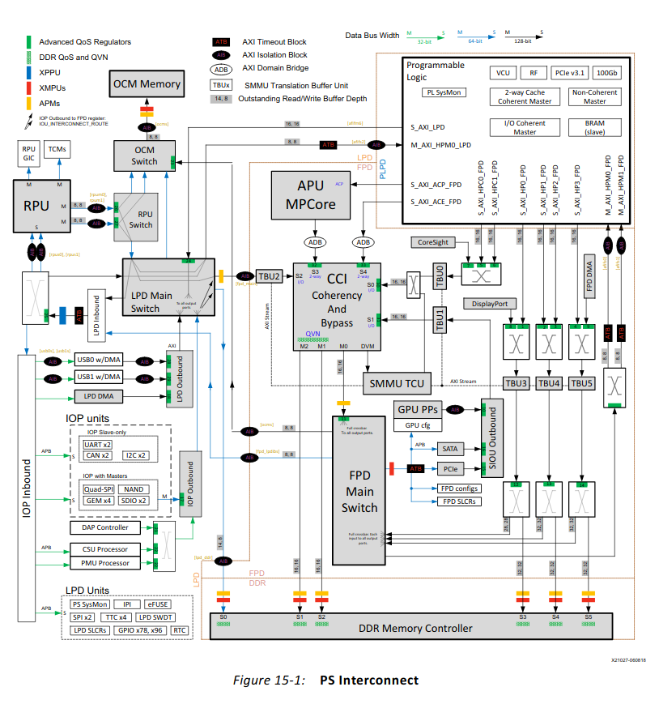

Small tcl Script that can be executed in xsct the read the total amount of RAM transfers. Just in case you cant use the System Performance Monitor in SDK. Reads the total read / write transactions and amount of transfered bytes once a second from the S1 & S2 ports of the DDR memory controller. 



```
xsct% connect                                                                   
tcfchan#0

xsct% target 4    
                                                              
xsct% source apm-monitor.tcl                                                        
Total Write Transactions: 4762                                                  
Total Read Transactions: 27933
Total Written Bytes: 304832
Total Read Bytes: 1790528


Total Write Transactions: 4578                                                  
Total Read Transactions: 27156
Total Written Bytes: 292992
Total Read Bytes: 1737984


Total Write Transactions: 5033                                                  
Total Read Transactions: 29600
Total Written Bytes: 322176
Total Read Bytes: 1894592
```
